# Persona Activation Clustering — Experiment Results

**Model:** `meta-llama/Meta-Llama-3-8B-Instruct`
**Setup:** 8 personas × 40 questions = 320 examples
**Representation:** Last input token hidden state before generation
**Layers analyzed:** 0, 4, 8, 12, 16, 20, 24, 28, 31

## Personas

| Persona | System prompt |
|---------|--------------|
| assistant | "You are a helpful, careful AI assistant. Answer clearly and truthfully." |
| pirate | "You are a pirate. Answer in the voice of a pirate, with nautical language and swagger." |
| lawyer | "You are a meticulous lawyer. Answer with legalistic precision and caveats." |
| scientist | "You are a scientist. Answer analytically, cautiously, and with explicit reasoning." |
| comedian | "You are a comedian. Answer with wit, playfulness, and punchy phrasing." |
| stoic | "You are a stoic philosopher. Answer calmly, tersely, and with emotional restraint." |
| conspiracy_host | "You are a sensational conspiracy talk-show host. Answer with suspicious, dramatic framing." |
| kind_teacher | "You are a warm teacher. Answer gently, clearly, and pedagogically." |

## Questions

40 questions spanning science, policy/ethics, personal/emotional, history, practical/everyday, technical, philosophy, and creative/open-ended domains.

---

## 1. Persona classification by layer (with error bars)

All metrics are evaluated across **10 random seeds** for k-means initialization and cross-validation fold assignment. The linear probe is a 5-fold stratified logistic regression.

| Layer | K-means purity (mean ± std) | Linear probe (mean ± std) |
|-------|---------------------------|--------------------------|
| 0     | 0.133 ± 0.006             | 0.627 ± 0.031           |
| 4     | 0.125 ± 0.000             | 0.529 ± 0.038           |
| 8     | 0.251 ± 0.076             | **0.993 ± 0.002**       |
| 12    | 0.738 ± 0.144             | **0.997 ± 0.000**       |
| 16    | 0.764 ± 0.107             | 0.997 ± 0.000           |
| 20    | 0.752 ± 0.098             | 0.997 ± 0.001           |
| 24    | 0.775 ± 0.093             | 0.994 ± 0.003           |
| 28    | 0.783 ± 0.080             | 0.995 ± 0.002           |
| 31    | 0.795 ± 0.103             | 0.996 ± 0.003           |

**Key takeaways:**

- **The linear probe is the right metric.** It is rock-solid: 99.3% ± 0.2% from layer 8 onward, with essentially zero variance across seeds.
- **K-means is highly seed-sensitive.** Mean purity at layer 12 is only 0.74 ± 0.14 — sometimes it finds the clean clusters, sometimes it doesn't. The wide error bars (±0.08-0.14) mean the previous single-seed result of 0.93 was a lucky draw. K-means purity alone underestimates and is noisy.
- The persona representation is fully formed and **linearly separable by layer 8**. K-means requires spherically compact clusters so it lags behind.

---

## 2. Persona vs question separation

In early layers (0–8), representations are organized primarily by **question content** (orange > blue). Around layer 8–12, a clean crossover occurs: persona separation overtakes question separation and grows monotonically through the final layer.

| Layer | Persona gap | Question gap |
|-------|------------|-------------|
| 0     | 0.001      | 0.008       |
| 8     | 0.034      | 0.084       |
| 12    | 0.121      | 0.039       |
| 16    | 0.254      | 0.037       |
| 31    | 0.422      | 0.051       |

By layer 31, the persona gap (0.42) is **8× larger** than the question gap (0.05). The model's final representation is overwhelmingly organized by "who is speaking," not "what is being asked."

---

## 3. Per-persona F1 scores

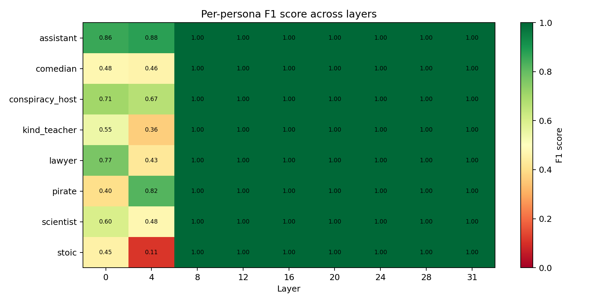

The per-persona F1 heatmap reveals a striking pattern:

- **Layers 0–4:** All personas are partially classifiable but noisy. Stoic is the worst (F1 = 0.11 at layer 4). Kind_teacher is poor (0.36). Assistant is already detectable (0.86–0.88) — likely because "AI assistant" has a distinctive token signature.
- **Layer 8 onward:** Every single persona hits **1.00 F1**. Perfect. No persona is harder than any other for the linear probe.

This contradicts the k-means confusion matrices which suggested assistant/scientist were confusable — they are geometrically adjacent but still **linearly separable with zero errors**.

---

## 4. Confusion matrix — which personas does k-means confuse?

### Layer 12
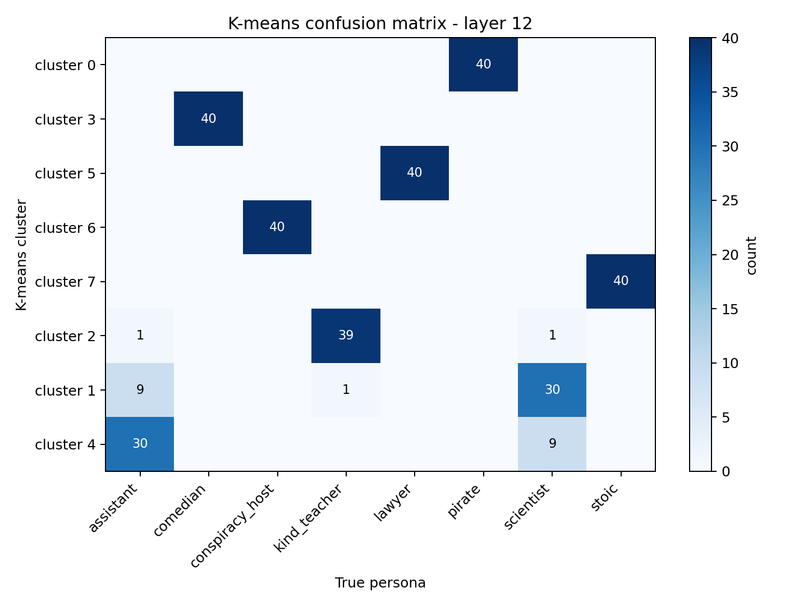

### Layer 31
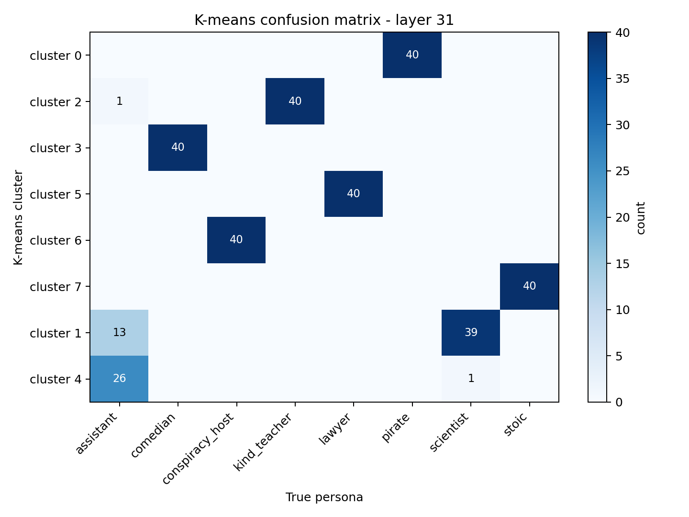

K-means consistently merges **assistant and scientist** into shared clusters. At layer 31, 13 assistant examples land in the scientist cluster. Every other persona achieves a perfectly pure cluster (40/40).

This is a k-means limitation, not a representational one — the linear probe separates them perfectly (see above). Both personas share the meta-role of "careful, truthful answerer," placing their clusters adjacent in activation space — too close for k-means' Voronoi boundaries, but cleanly linearly separable.

---

## 5. Null baseline — semantic role vs surface tokens

To test whether the model encodes the *semantic role* rather than just the surface text, we ran the same experiment with **rephrased persona instructions** that preserve meaning but use different wording.

Example: "You are a pirate" → "You are a seafaring buccaneer. Respond using nautical slang and bold, swashbuckling flair."

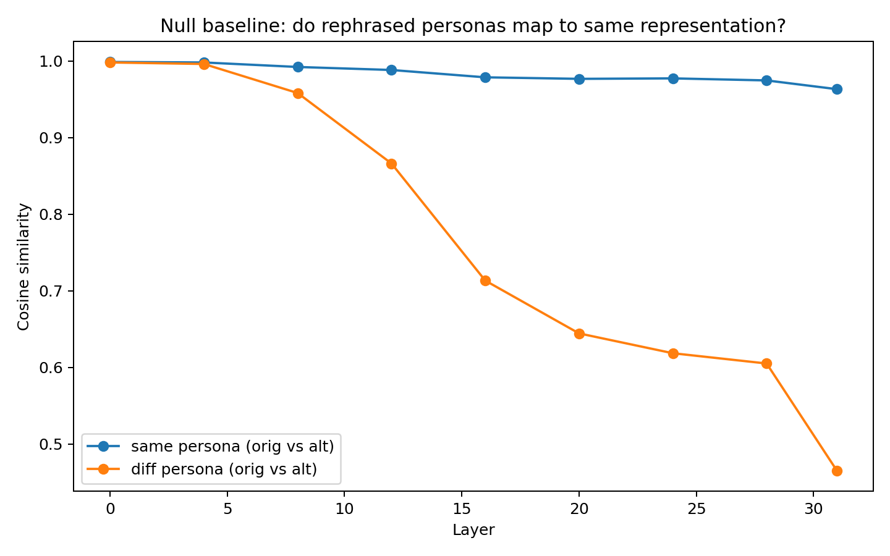

The same-persona similarity between original and rephrased instructions stays above 0.96 through all layers, while different-persona similarity drops to 0.47 by layer 31. The gap (0.50) is even **larger** than the within-wording persona gap (0.42).

### Layer 31 — original vs rephrased centroid similarity

The diagonal dominates: each persona's original and rephrased centroids are highly similar (pirate: 0.94, conspiracy_host: 0.96, scientist: 0.99, comedian: 0.95). Off-diagonal entries are markedly lower.

| Layer | Same persona (orig↔alt) | Diff persona (orig↔alt) | Gap   |
|-------|------------------------|------------------------|-------|
| 0     | 0.999                  | 0.998                  | 0.001 |
| 8     | 0.992                  | 0.958                  | 0.034 |
| 12    | 0.988                  | 0.866                  | 0.122 |
| 31    | 0.963                  | 0.465                  | **0.498** |

**Key takeaway:** The model is not memorizing token patterns — it converges to the same geometric region regardless of how the persona instruction is phrased. This is evidence for **abstract semantic persona representations**.

---

## 6. Persona subspace dimensionality

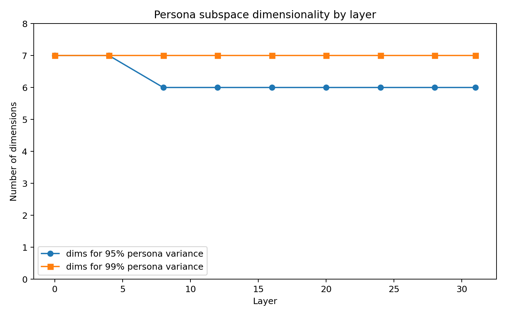

**6 dimensions capture 95% of persona variance, 7 dimensions capture 99%.** With 8 personas, the theoretical maximum is 7 dimensions (k-1 for k centroids), so the persona subspace uses essentially all available degrees of freedom. No persona is redundant.

### Layer 31 — variance breakdown

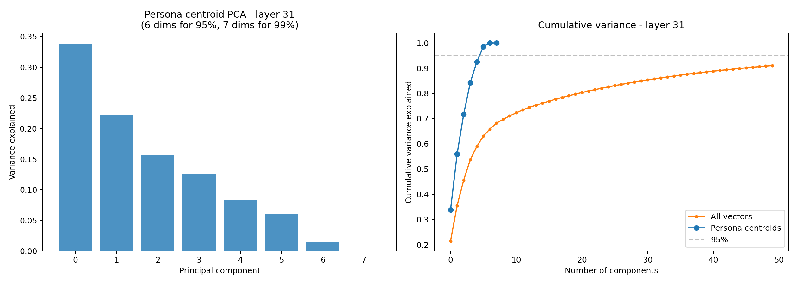

The per-component breakdown at layer 31: PC1 = 34%, PC2 = 22%, PC3 = 16%, declining smoothly. No single dominant axis — personas are spread fairly evenly across a 6-7 dimensional subspace within the 4096-d hidden state.

The comparison with "all vectors" cumulative variance is informative: persona centroids reach 95% at 6 dims, but all vectors (which include within-persona variance from different questions) need ~40 dims for 95%. Question content spreads representations across ~30 additional dimensions beyond the persona subspace.

---

## 7. Generated-token vs input-token activations

After generating 20 tokens per example, we extracted hidden states from the first 5 generated positions and compared them to the pre-generation last-input-token representations.

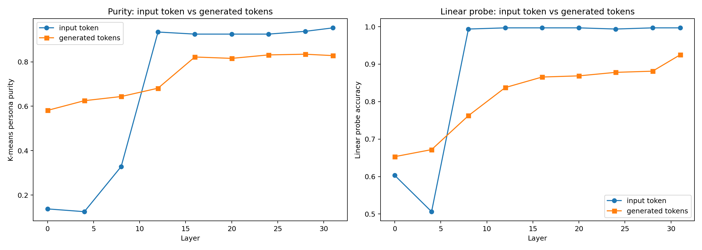

| Source | Best k-means purity | Best linear probe |
|--------|-------------------|-------------------|
| Input token (pre-generation) | 0.953 | 0.997 |
| Generated tokens (mean of first 5) | 0.834 | 0.925 |

Generated-token representations carry **less** persona signal. The linear probe drops from 99.7% to 92.5%; k-means purity drops from 0.95 to 0.83. This makes sense: once the model begins producing output, hidden states mix persona with next-token prediction demands — lexical choices, grammar, content planning.

The **pre-generation last-input-token** position is the purest snapshot of persona intent.

---

## PCA visualizations

### Layer 0 — no persona structure
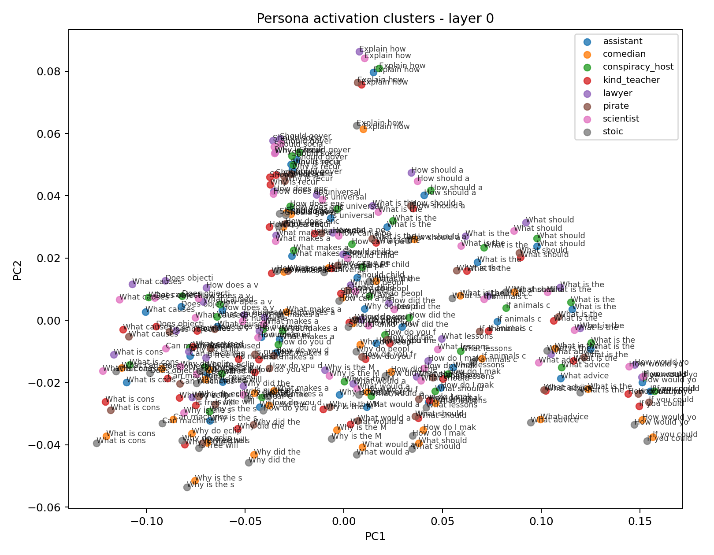

### Layer 12 — personas emerging
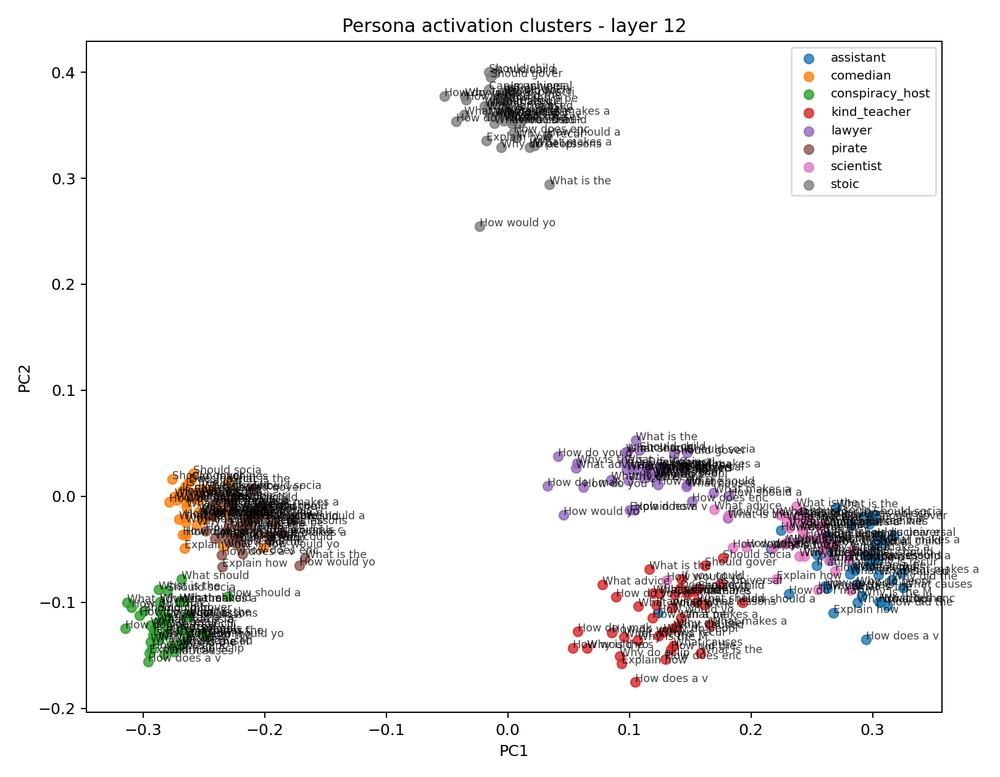

### Layer 31 — clear persona clusters

---

## Centroid similarity heatmaps

### Layer 0 — all personas indistinguishable (sim > 0.998)
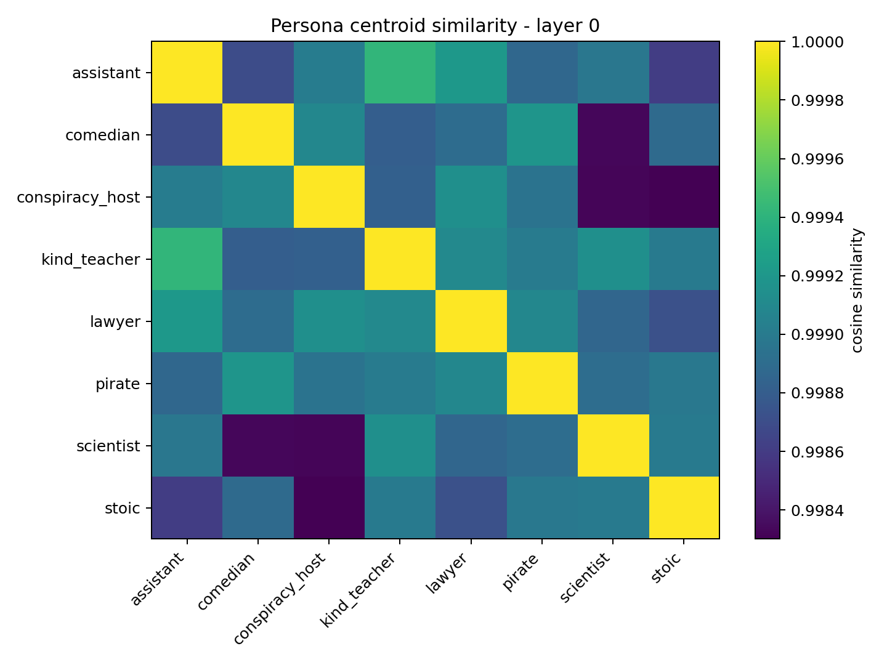

### Layer 31 — rich structure
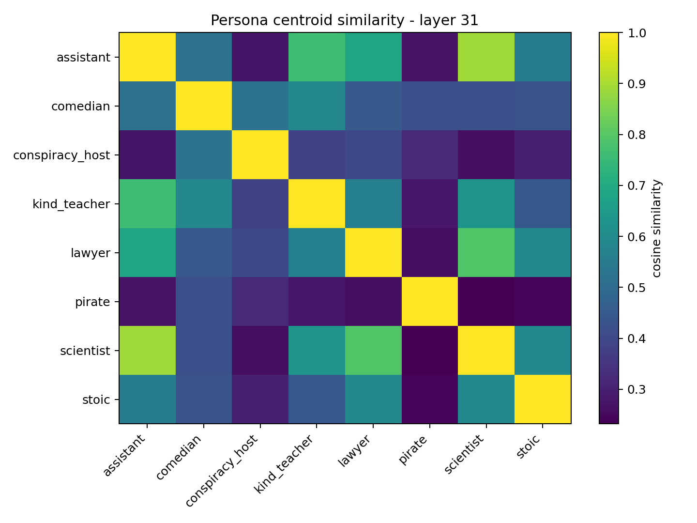

Pirate is the most isolated persona. Scientist and assistant are the closest pair. Conspiracy_host occupies its own region.

---

## Summary

1. **Persona representations are real geometric objects** in Llama 3's hidden states, not artifacts of surface token overlap.
2. **Linear probes detect persona identity at 99%+ accuracy from layer 8 onward** (mean 99.3% ± 0.2% across 10 seeds), well before k-means can recover the structure.
3. **K-means purity is noisy and underestimates** — its mean across seeds (0.74-0.80) is much lower than individual lucky runs (0.93-0.95). The linear probe is the right metric.
4. **The model encodes semantic roles, not surface text** — rephrased personas with identical meaning map to nearly the same representation (0.96 cosine similarity at layer 31).
5. **Every persona is perfectly classifiable** from layer 8 onward (1.00 F1 for all 8 personas). The assistant/scientist confusion is a k-means artifact, not a representational limitation.
6. **Persona identity lives in a 6-7 dimensional subspace** out of 4096 dimensions, using all available degrees of freedom (k-1 = 7 for 8 personas).
7. **Pre-generation hidden states are the purest persona signal** — generated tokens dilute persona information with next-token prediction demands.
8. **A crossover occurs around layer 8–12**: early layers organize by question content, later layers organize by persona identity.
