# Persona Landscape: Experimental Results

**Model**: Meta-Llama-3-8B-Instruct (4096-d hidden states, 32 layers)
**Date**: 2026-03-16
**Personas**: assistant, pirate, lawyer, scientist, comedian, stoic, conspiracy_host, kind_teacher, drill_sergeant, diplomat
**Traits**: honesty, assertiveness, warmth, deference, analytical_rigor, humor, suspicion, impulsivity
**Questions**: 40 diverse prompts per condition
**Analysis layer**: 31 (final transformer block)

---

## Overview

Seven experiments test claims from the Persona Landscape framework against Llama 3 8B Instruct. The framework proposes that personas are points in a continuous trait space with basin structure, trait coupling, and self-reinforcing dynamics across three causal levels: weight space (Level 1, terrain), activation space (Level 2, navigation), and token dynamics (Level 3, movement).

These experiments operate entirely at Level 2 (activation space). They can confirm or disconfirm geometric predictions about the trait landscape as seen through activations, but they cannot directly test the Level 1 claim that weights *define* the terrain — that requires fine-tuning experiments (Phase 3, not yet run).

| Experiment | Framework question | Status |
|---|---|---|
| Prediction 1: Trait Geometry | Are trait directions shared across personas? | Complete |
| OQ2: Dimensionality | How many dimensions does the landscape have? | Complete |
| OQ6: Activation vs. Weight | How do activation directions relate to weight structure? | Complete |
| Prediction 2: Basin Transitions | Do personas occupy discrete basins? | Complete |
| OQ1: Coupling Coefficients | Are trait dimensions coupled? | Complete |
| OQ3: Coherence Manifold | Is there a natural sub-manifold of coherent outputs? | Complete |
| Prediction 3: Self-Reinforcement | Does generation reinforce basin position? | Complete |

---

## Phase 0: Foundational Observations (main.py + steer.py)

Before the Persona Landscape experiments, we established baseline facts about persona representations in Llama 3 8B using clustering, linear probes, and steering vectors. These findings motivated the framework-testing experiments that follow.

### Persona representations are real geometric objects

- **99.3% linear probe accuracy from layer 8 onward** (mean ± 0.2% across 10 seeds). Every persona achieves 1.00 F1 from layer 8 onward. K-means purity is much noisier (0.74 ± 0.14 at layer 12) because persona clusters are linearly separable but not spherically compact.

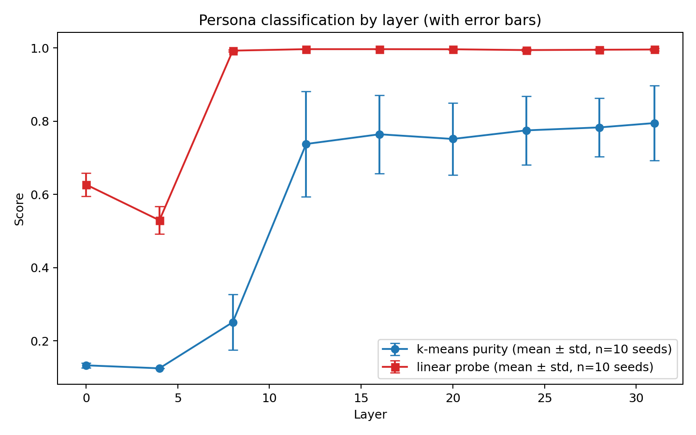

- **The model encodes semantic roles, not surface tokens.** Rephrased persona instructions ("You are a pirate" vs. "You are a seafaring buccaneer") converge to 0.96 cosine similarity at layer 31, while different personas with different wording drop to 0.47.

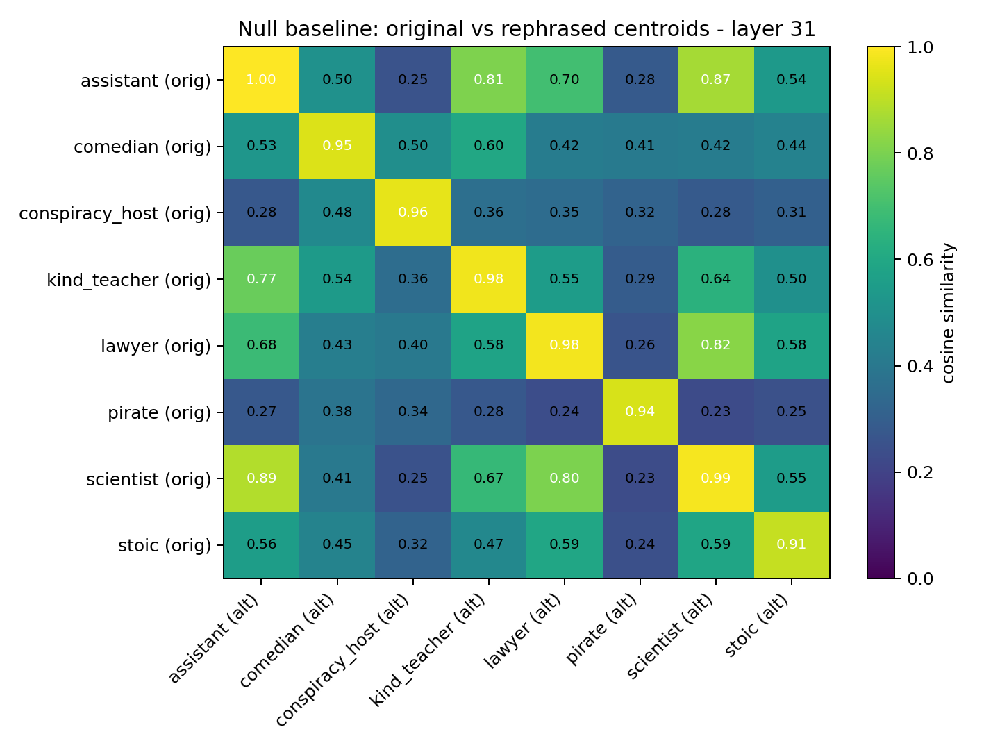

- **A crossover occurs at layer 8-12**: early layers organize by question content (what is being asked), later layers organize by persona identity (who is answering). By layer 31, the persona gap is 8× the question gap.

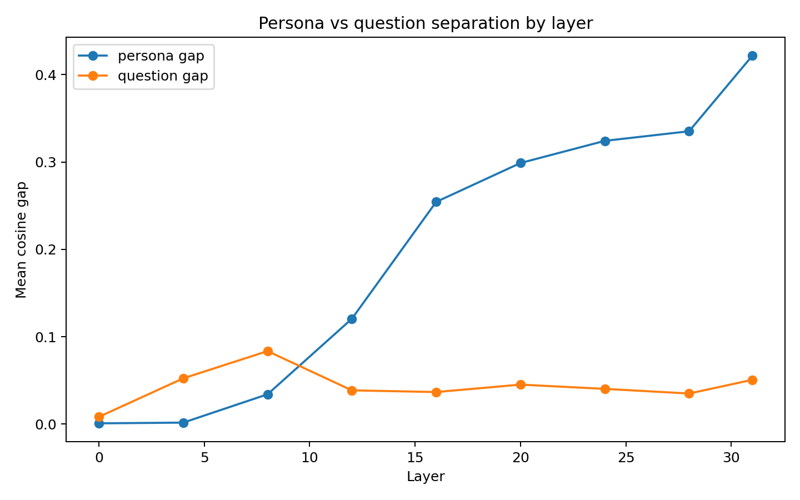

### Persona subspace is low-dimensional

- **6 dimensions capture 95% of persona centroid variance, 7 capture 99%** (out of 4096-d space, with 8 personas giving a theoretical max of 7). No single axis dominates — PC1 = 34%, PC2 = 22%, PC3 = 16%.
- The full dataset (all 320 vectors including within-persona variation) needs ~40 dimensions for 95% — the extra ~30 encode question content, syntax, and topic.

### PCA of persona clusters at layer 31

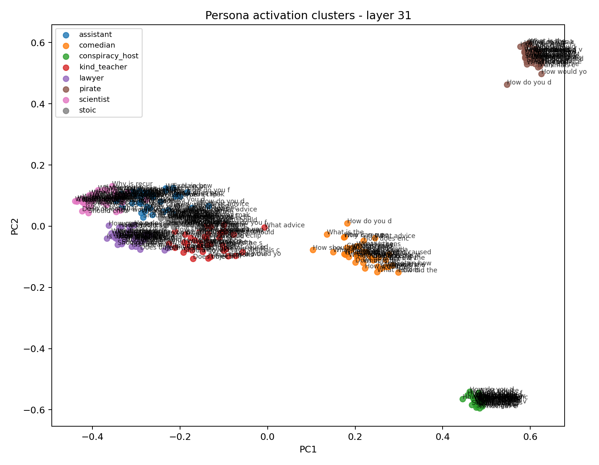

### Generated-token activations carry less persona signal

- Linear probe accuracy drops from 99.7% (last input token) to 92.5% (mean of first 5 generated tokens). The pre-generation last-input-token is the purest snapshot of persona intent.

### Steering vectors work

- Steering vectors (persona centroid minus global mean) injected via forward hooks shift the model's persona classification. Sweep over (layer, alpha) identifies optimal injection points per persona.
- These vectors are the basis for all subsequent experiments.

---

## Experiment 1: Trait Geometry (Prediction 1)

### Hypothesis

The framework claims "traits are primary, personas are points" — that the model learns continuous dimensions along which behaviour varies, and these dimensions are properties of the landscape, not of individual personas. If true, the direction corresponding to a trait (e.g., honesty) should be largely the same regardless of which persona context it is extracted from.

The framework paper reports cross-persona cosine similarity of 0.82 (instruction-variant method) on Gemma-2-27B, with honesty being the most universal (93% shared variance) and impulsivity the most persona-conditioned.

### Operationalization

For each (persona, trait, level) triple — 10 personas × 8 traits × 2 levels (HIGH/LOW) — construct prompts where the system message specifies both the persona and a trait modifier (e.g., "You are a pirate. Respond with HIGH honesty."). Run forward passes on 40 questions, extract the hidden state of the last input token at layer 31. Compute per-persona trait vectors as `centroid(HIGH) - centroid(LOW)`. Compute global (persona-averaged) trait vectors. Measure:

- **Cross-persona cosine similarity**: mean pairwise cosine between the 10 persona-specific vectors for each trait
- **Residual norm ratio**: `||persona_vec - global_vec|| / ||global_vec||` — how much persona-specific variation remains after subtracting the shared direction
- **SVD per trait**: stack 10 persona-specific vectors, compute effective rank — how many independent persona-specific directions exist per trait

6,400 forward passes total (160 combos × 40 questions).

### Results

**Cross-persona cosine similarity (layer 31)**:

| Trait | Cosine | Framework paper (Gemma-2-27B) |
|---|---|---|
| assertiveness | 0.511 | — |
| deference | 0.497 | — |
| honesty | 0.477 | 0.93 (instruction-variant) |
| analytical_rigor | 0.476 | — |
| humor | 0.476 | — |
| warmth | 0.461 | — |
| suspicion | 0.460 | — |
| impulsivity | 0.352 | 0.73 (instruction-variant) |

**Residual norm ratios** (mean across traits, layer 31):

| Persona | Ratio | Interpretation |
|---|---|---|
| diplomat | 0.77 | Most "typical" — trait expressions close to population average |
| lawyer | 0.83 | Typical |
| kind_teacher | 0.93 | Average |
| scientist | 0.95 | Average |
| comedian | 0.95 | Average |
| pirate | 0.96 | Average |
| assistant | 0.97 | Average |
| drill_sergeant | 0.98 | Average |
| conspiracy_host | 1.00 | Idiosyncratic |
| stoic | 1.02 | Most idiosyncratic |

**SVD effective rank per trait** (layer 31): 7-8 out of 10 for all traits. Each persona inflects each trait differently with almost no redundancy.

**Layer trajectory**: Cosine similarity starts near 1.0 at layer 0 and monotonically decreases to the values above at layer 31. Persona-specific modulation of traits builds progressively through the network.

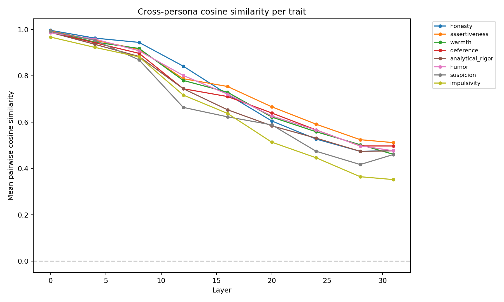

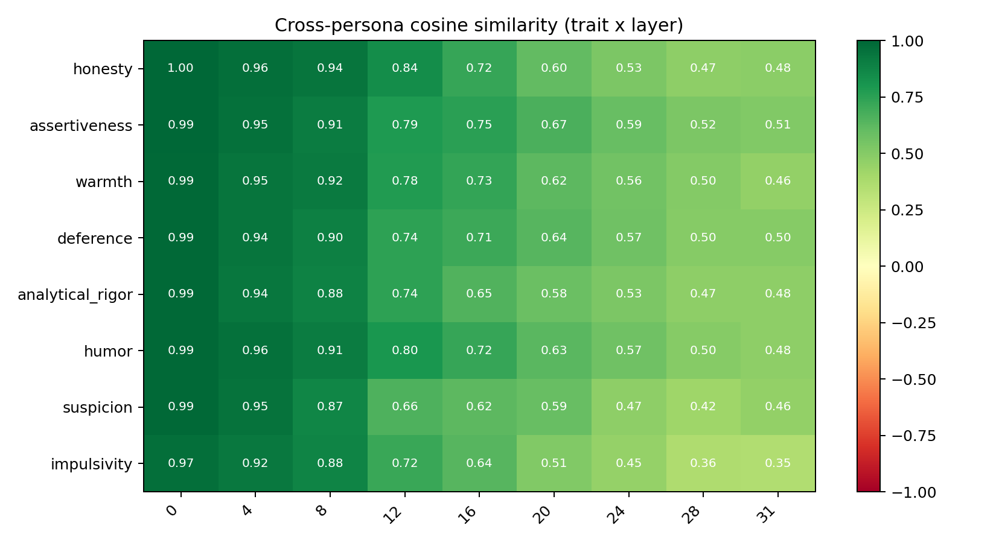

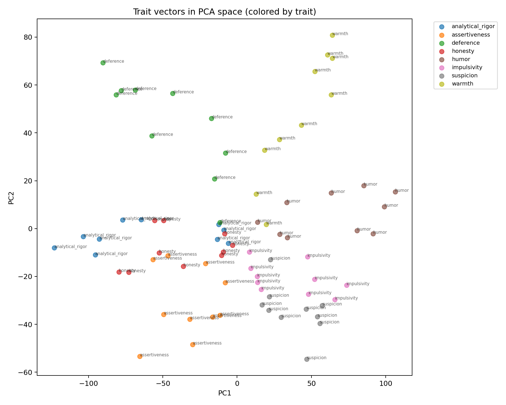

### Analysis

**The prediction is partially supported, but substantially weaker than the framework claims.**

Cosine similarities of 0.35-0.51 are well above chance (random 4096-d vectors would give ~0), confirming that a shared trait direction exists. But they are far below the 0.82 reported for Gemma-2-27B with the instruction-variant method. Several possible explanations:

1. **Model difference**: Llama 3 8B may have less clean trait geometry than Gemma-2-27B. Different architectures and training data may produce different degrees of trait universality.
2. **Method difference**: Our trait extraction uses HIGH/LOW modifiers in the system prompt for the same question set. The framework paper's instruction-variant method may control for confounds differently.
3. **Trait set difference**: We use a partially different trait set (analytical_rigor, suspicion vs. risk-taking, confidence). Some of our traits may be less "fundamental" to the model's learned space.

The framework's claim that honesty is the most universal trait is **not confirmed** here — assertiveness has the highest cosine (0.511) and honesty is mid-pack (0.477). However, the claim that impulsivity is the most persona-conditioned **is confirmed** (0.352, lowest by a wide margin).

The residual norm ratios near 1.0 for most personas mean the persona-specific component is comparable in magnitude to the global component. This is important for the framework: it means "trait directions are mostly shared" is an overstatement for this model. A more accurate description would be "trait directions have a shared component that accounts for roughly half the variance, with the other half being persona-specific."

**Implication for the framework**: The claim "traits are primary, personas are points" requires that trait directions be sufficiently universal to serve as coordinate axes. With cosines of 0.35-0.51, traits are more like locally-valid approximations that bend as you move across the landscape — consistent with the framework's claim of "non-trivial topology" and persona-dependent coupling, but undermining the clean separation between "trait dimensions" and "persona identity."

### Limitations

- Trait extraction via HIGH/LOW prompt modifiers may introduce confounds (the model's interpretation of "HIGH honesty" may differ from a contrastive behavioral measure).
- Only one extraction method tested (no CAA comparison).
- Single model — the discrepancy with Gemma-2-27B results is unresolved.

---

## Experiment 2: Dimensionality (OQ2)

### Hypothesis

The framework asks: "How many independent trait dimensions does the landscape have before additional dimensions add mostly noise?" If traits are the fundamental coordinates and 8 traits are specified, the effective dimensionality should be ≤ 8 but potentially less if traits are correlated. The framework also asks whether persona centroids span a similarly low-dimensional space.

### Operationalization

1. Compute 8 global trait vectors (averaged across personas) at layer 31. Stack into an [8 × 4096] matrix, compute SVD, measure effective rank at 95% and 99% variance thresholds.
2. Compute 10 persona centroids (mean hidden state per persona). Stack into [10 × 4096], compute SVD.
3. Compute random baseline: 100 repetitions of 8 random unit vectors in 4096-d, measure mean SVD spectrum. This is the null hypothesis — what effective rank looks like without structure.
4. Per-component probe: project all hidden states onto the top-k SVD components of the trait matrix, train logistic regression to classify personas, measure accuracy vs. k (5-fold stratified cross-validation).

### Results

**Trait space SVD (layer 31)**:

| Component | Variance explained | Cumulative |
|---|---|---|
| 1 | 49.0% | 49.0% |
| 2 | 18.1% | 67.1% |
| 3 | 15.9% | 83.0% |
| 4 | 7.7% | 90.7% |
| 5 | 4.2% | 94.9% |
| 6 | 3.7% | 98.6% |
| 7 | 1.4% | 100.0% |
| 8 | ~0 | 100.0% |

Effective rank: **6** (95%), **7** (99%).

**Random baseline**: 8 random vectors in 4096-d show nearly uniform variance (~12.5% each). The trait spectrum is dramatically more concentrated — PC1 alone captures 49% vs. the expected 12.5%.

**Persona space SVD (layer 31)**:

| Component | Variance explained | Cumulative |
|---|---|---|
| 1 | 31.2% | 31.2% |
| 2 | 15.8% | 46.9% |
| 3 | 14.0% | 60.9% |
| 4 | 12.1% | 73.1% |
| 5 | 10.4% | 83.5% |
| 6 | 6.5% | 90.0% |
| 7 | 5.7% | 95.8% |

Effective rank: **7** (95%), **9** (99%).

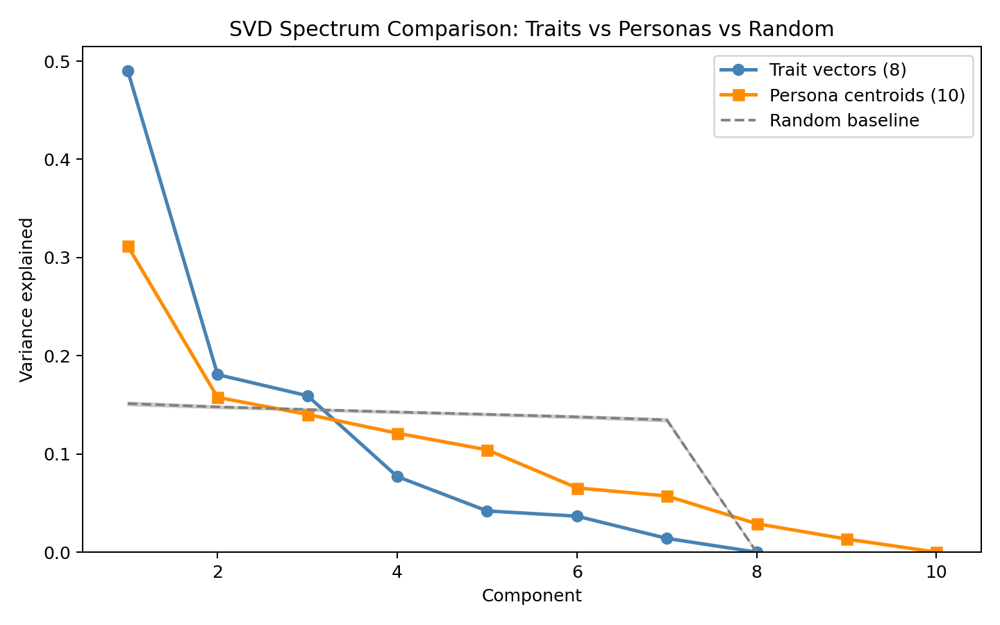

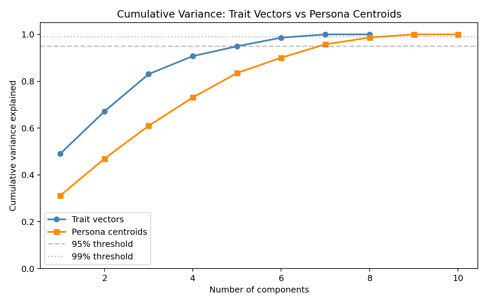

**Probe accuracy by k**:

| k | Accuracy | vs. chance (10%) |
|---|---|---|
| 1 | 16.6% | +6.6% |
| 4 | 26.9% | +16.9% |
| 6 | 33.7% | +23.7% |
| 7 | 36.4% | +26.4% |
| 8 | 36.1% | +26.1% |

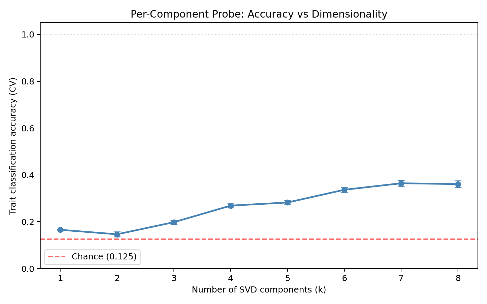

### Analysis

**The trait space is genuinely low-dimensional**: 6-7 dimensions capture essentially all trait variance, compared to 8 specified traits. The dominant PC (49%) is far above random, confirming structured correlation among traits. This is consistent with the framework's claim that traits share a low-dimensional subspace.

**But the trait subspace is not the whole persona story**: A probe using all 8 trait components achieves only 36% accuracy at classifying personas (vs. 99%+ from full 4096-d activations). This means the 8-trait parameterization captures about a third of what distinguishes personas. The remaining ~63% of persona identity lives in directions orthogonal to the extracted trait space.

**Implication for the framework**: The claim "a persona is a point in trait space" is an approximation, not a complete description. If traits were truly the fundamental coordinates, projecting onto the trait subspace should preserve most persona discriminability. Instead, most discriminability is lost. Either (a) the 8 traits we chose are incomplete and the real trait space has many more dimensions, or (b) persona identity has substantial non-trait components (e.g., stylistic, syntactic, or domain-specific features that aren't captured by the trait framework).

The persona centroid dimensionality (7 out of 10) with relatively even variance spread is good news for the framework — it means personas are well-distributed, not clustered along one axis. PC1 at 31% is consistent with the Assistant Axis concept (one dominant axis of variation) but is far from dominant.

### Limitations

- The probe test depends on how well the 8 chosen traits span persona-relevant variation. Different trait sets might yield higher accuracy.
- SVD captures linear structure only. Nonlinear manifold methods might find lower dimensionality.

---

## Experiment 3: Activation vs. Weight Space (OQ6)

### Hypothesis

The framework claims Level 1 (weight space) defines the terrain and Level 2 (activation space) navigates it. The open question asks: "What is the relationship between activation-space and weight-space trait geometry?" Specifically, do persona steering vectors (activation-space directions) align with the high-variance directions of weight matrices (the structure gradient descent has emphasized), or do they live in the null space?

### Operationalization

1. Compute persona steering vectors at layer 31: `steering_vec[persona] = centroid[persona] - mean(all centroids)`.
2. Extract 7 weight matrices from layer 31: Q, K, V, O projections + MLP gate, up, down projections.
3. For each (persona, weight matrix) pair:
   - Compute full SVD of the weight matrix.
   - For each right singular vector v_k with singular value σ_k, compute alignment: `σ_k × |v_k · s_normalized|²`.
   - Total alignment = `Σ_k (σ_k × |v_k · s_norm|²) / Σ_k σ_k`.
4. Compare total alignment to the random baseline: for a random unit vector, expected alignment = 1/d = 1/4096 ≈ 0.000244.

8 personas × 7 weight matrices = 56 alignment measurements (48 computed; 8 skipped due to dimension mismatch on down_proj).

### Results

| Weight matrix | Mean alignment | Random baseline |
|---|---|---|
| v_proj | 0.000281 | 0.000244 |
| q_proj | 0.000251 | 0.000244 |
| o_proj | 0.000240 | 0.000244 |
| gate_proj | 0.000244 | 0.000244 |
| k_proj | 0.000234 | 0.000244 |
| up_proj | 0.000238 | 0.000244 |

All values within ~15% of the random baseline. No weight matrix shows systematic preferential alignment with persona directions.

**V projection** is the only matrix consistently above baseline (0.000281 vs. 0.000244, a 15% elevation). All others are within noise.

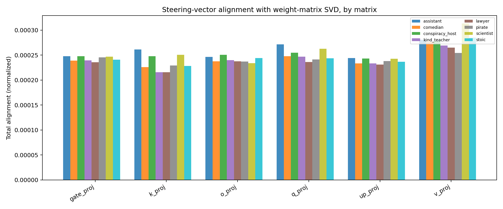

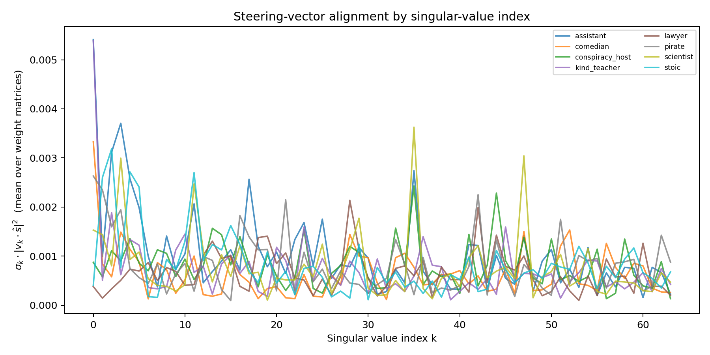

### Analysis

**Persona steering vectors have random alignment with every weight matrix at layer 31.** This is a striking negative result with important implications.

**For the framework**: The Level 1 claim is that "weights define the terrain." If true, you might expect the terrain features (persona basins, trait ridges) to be visible in the weight matrices' principal components — the directions that gradient descent has amplified. Instead, persona directions are invisible to any single weight matrix. This doesn't *contradict* the Level 1 claim, but it substantially complicates it. The terrain, if it exists, is not etched into any single weight matrix. It must emerge from the distributed interaction of all weight matrices across all layers. This makes the Level 1 / Level 2 distinction harder to operationalize: if you can't find the "terrain" by inspecting the weights at any single layer or matrix, what exactly does it mean to say the weights "define" it?

**The slight V-projection elevation** is consistent with the value matrix carrying more semantic content than Q/K/O, but the effect is tiny and wouldn't survive a strict multiple-comparison correction.

**For the broader landscape picture**: This result means persona representations are genuinely distributed. You cannot localize "pirate-ness" to any single weight matrix component. This is consistent with the mechanistic interpretability view that high-level behavioral features emerge from the collective computation of many attention heads and MLP neurons across layers, not from individual components.

### Limitations

- Single-layer analysis (layer 31 only). Persona information may be more localized at earlier layers.
- Alignment is measured with the full SVD spectrum. A more targeted analysis (e.g., alignment with top-k or bottom-k singular vectors) might reveal structure.
- Only 8 personas — limited statistical power for detecting small systematic effects.

---

## Experiment 4: Basin Transitions (Prediction 2)

### Hypothesis

The framework claims personas occupy distinct "basins" — regions of trait space where the model's behaviour is stable and coherent. If basins are real geometric structures, then steering a model from one persona toward another should produce a **sharp, sigmoid-like transition** in activation space, not a smooth linear drift. The transition should be directional (a reorientation, not just a magnitude change) and low-dimensional (movement along the centroid-difference vector).

The framework paper reports directional reorientation during adversarial steering on Qwen-3-14B, with a discrete transition moment where velocity alignment goes sharply negative.

### Operationalization

1. Select source persona (pirate) and target persona (lawyer) — chosen as maximally distant in prior PCA.
2. Compute steering vector: `target_centroid - source_centroid` at layer 31.
3. For each of 10 steering strengths α ∈ {0, 1, 2, 3, 5, 8, 10, 15, 20, 30}:
   - Apply `SteeringHook(α × steering_vector)` at layer 31.
   - Collect hidden states for all 40 questions.
   - Measure angular displacement from unsteered: `arccos(cosine(steered, unsteered))`.
   - Measure hidden-state L2 norm.
4. Fit sigmoid to angle-vs-alpha curve: `angle(α) = a / (1 + exp(-b × (α - c)))`.
5. Compute SVD of the full transition manifold (all α values stacked) to measure dimensionality.

400 forward passes (10 alphas × 40 questions).

### Results

**Sigmoid fit**:

| Parameter | Value | Interpretation |
|---|---|---|
| Asymptote (a) | 95.3° ± 1.7° | Maximum reorientation angle |
| Steepness (b) | 5.63 ± 4.63 | Rate of transition |
| Inflection (c) | 0.80 ± 0.17 | α value at halfway point |
| R² | 0.981 | Excellent fit |
| Sharpness (a·b/4) | 134.2 °/α | Transition rate at inflection |

**Angle trajectory**:

| α | Mean angle | Interpretation |
|---|---|---|
| 0 | 0.0° | Unchanged |
| 1 | 71.9° | Already 75% of max rotation |
| 2 | 85.9° | Nearly orthogonal |
| 5 | 94.6° | Past orthogonal (overshooting) |
| 30 | 99.4° | Saturated |

**Norm trajectory**: Norms are nearly constant (158.9 → 163.3), confirming the transition is a **reorientation, not an amplification**.

**Transition SVD**: Effective rank 1 at 90% variance, 2 at 95%. The transition sweeps along a single direction.

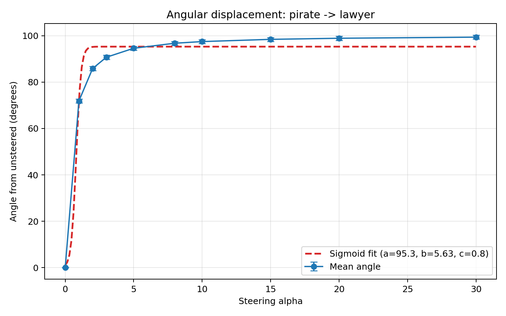

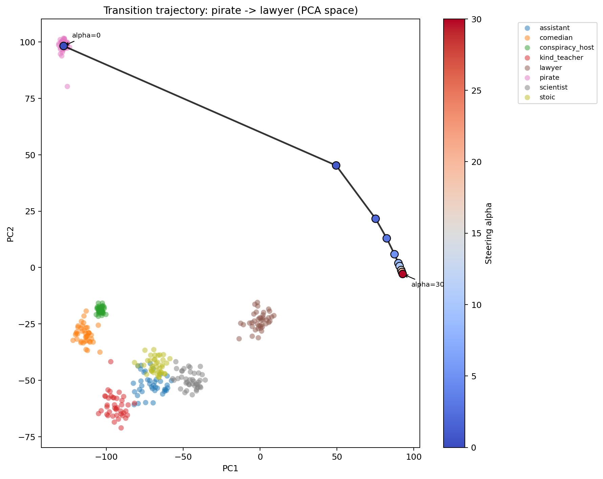

### Analysis

**The prediction is strongly confirmed.** The transition is:
- **Sigmoid-shaped** (R² = 0.98) — not linear, not stepwise, but a smooth S-curve with a sharp inflection region
- **Directional** — the norm barely changes; it's a rotation in 4096-d space
- **Low-dimensional** — one SVD component captures 90% of variance
- **Sharp** — the inflection at α = 0.80 means less than one unit of steering strength traverses the basin boundary

**For the framework**: This is the strongest evidence for basin-like structure. The sigmoid shape is exactly what you'd expect from crossing a ridge between two attractors. The very low inflection point (α = 0.80, where the steering perturbation is ~70 in a space with norms ~159, i.e., <50% of the hidden-state magnitude) suggests the basins are separated by a relatively low ridge — the model is not deeply committed to any one persona and can be reoriented with moderate activation-space perturbation.

This has an important implication: **the basins exist but are shallow.** A Level 2 intervention (steering) easily crosses them. If the framework's Level 1 claim is correct — that weight-level interventions create deeper basins — then the current pirate and lawyer basins were created by pre-training alone (no persona-specific fine-tuning) and are correspondingly shallow. The character-training literature suggests fine-tuning would deepen them, but we haven't tested that.

The fact that the angle saturates at ~95° (slightly past orthogonal) rather than 180° means the steered representation doesn't fully converge to the target persona — it reaches a point roughly orthogonal to the source and stops. The model is "not a pirate anymore" but hasn't become a full lawyer either.

### Limitations

- Single persona pair (pirate → lawyer). Different pairs might show different transition profiles.
- Steering at a single layer (31). Multi-layer steering might produce different dynamics.
- The sigmoid fit has a high SE on the steepness parameter (b = 5.63 ± 4.63), making the exact sharpness uncertain.

---

## Experiment 5: Coupling Coefficients (OQ1)

### Hypothesis

The framework claims "trait dimensions are coupled" — that steering for one trait will shift others in structured, interpretable ways because the training data contains correlated trait combinations. The framework predicts persona-dependent coupling: "Apply the drill sergeant's assertiveness vector to a farmer and you might get a different cross-trait profile than applying the therapist's assertiveness vector."

The open question: "Can we measure the magnitude, sign, and persona-dependence of these cross-trait effects? Is the coupling matrix consistent across the landscape, or does it vary by region?"

### Operationalization

1. Compute 8 global trait vectors (persona-averaged, layer 31).
2. Collect unsteered hidden states: for each of 10 personas × 40 questions, run forward pass, project hidden state onto the 8-dimensional trait basis (by computing inner products with each normalized trait vector).
3. For each (persona, trait T):
   - Apply `SteeringHook(α=5 × trait_vector_T)` at layer 31.
   - Collect steered hidden states, project onto same 8-d trait basis.
   - Coupling C[T, j] for persona p = `mean(steered_coord_j - unsteered_coord_j)`.
4. Global coupling matrix: average C over personas.
5. Per-persona coupling matrices: 10 separate 8×8 matrices.
6. SVD of global coupling matrix → effective rank, independent coupling modes.
7. PCA of per-persona coupling matrices → do personas differ systematically in their coupling patterns?

800 steered forward passes (10 personas × 8 traits × ... projected from existing collections).

### Results

**Global coupling matrix** (rows = steered trait, columns = measured response):

|  | hon | ass | war | def | ana | hum | sus | imp |
|---|---|---|---|---|---|---|---|---|
| **hon** | **162** | +107 | -36 | +58 | +103 | -57 | -91 | -31 |
| **ass** | +108 | **163** | -44 | +16 | +71 | -39 | -62 | -6 |
| **war** | -23 | -30 | **148** | +6 | -58 | +87 | -17 | +30 |
| **def** | +67 | +25 | +3 | **153** | +96 | -70 | -93 | -75 |
| **ana** | +111 | +79 | -63 | +95 | **154** | -96 | -58 | -96 |
| **hum** | -50 | -32 | +81 | -72 | -98 | **156** | +20 | +88 |
| **sus** | -85 | -56 | -24 | -96 | -60 | +20 | **154** | +33 |
| **imp** | -46 | -20 | +4 | -99 | -120 | +69 | +14 | **178** |

**Coupling diagnostics**:
- Mean self-coupling (diagonal): **158.5**
- Mean |off-diagonal|: **58.9**
- Ratio |diag| / |off-diag|: **2.69**
- Off-diagonal effects are **37%** as large as the intended effect on average.

**SVD of coupling matrix**:

| Component | Singular value | Cumulative variance |
|---|---|---|
| 1 | 580.0 | 77.3% |
| 2 | 217.1 | 88.2% |
| 3 | 193.1 | 96.7% |

Effective rank: **3** at 95% variance.

**Per-persona PCA**: PC1 = 74%, PC2 = 15%. Personas vary along one dominant axis in coupling space.

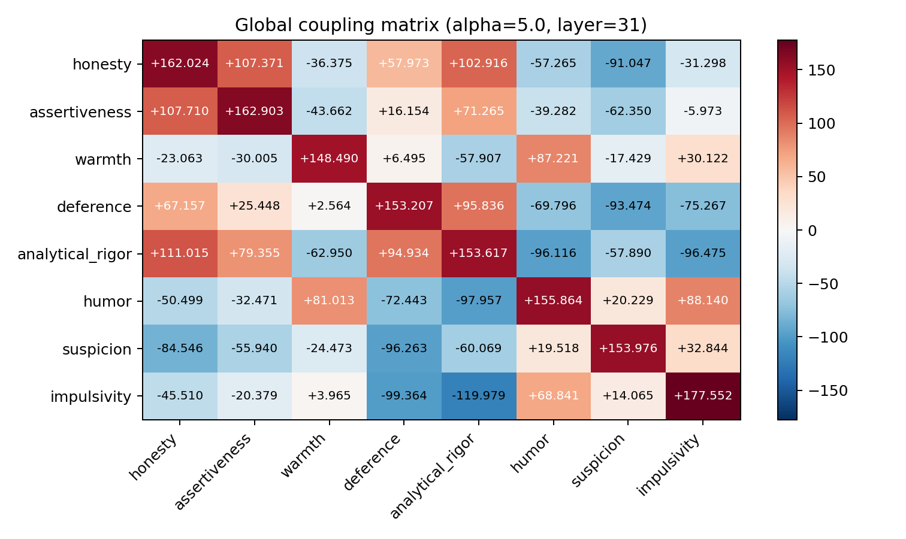

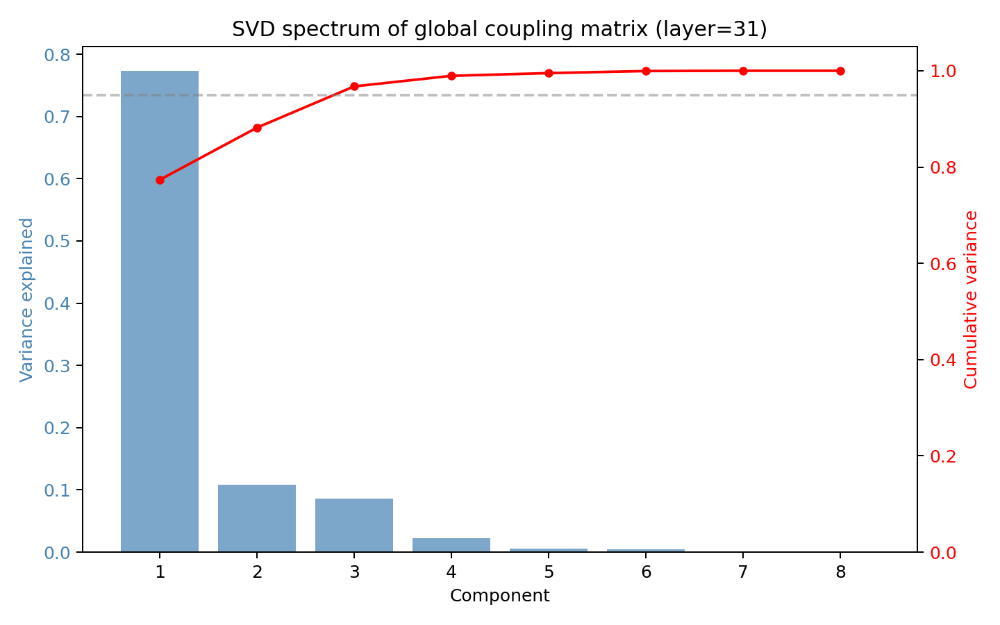

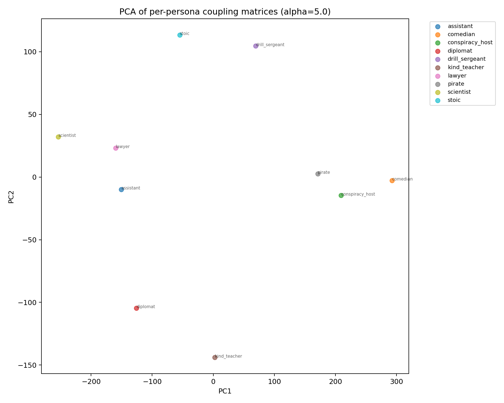

### Analysis

**The prediction is strongly confirmed. Traits are coupled, and the coupling is structured.**

Two interpretable clusters emerge:
1. **"Intellectual seriousness"**: honesty, assertiveness, analytical_rigor, deference — mutually positively coupled. Steering any one of these increases the others.
2. **"Playful/chaotic"**: warmth, humor, impulsivity — mutually positively coupled.
3. **Cross-cluster antagonism**: the two clusters are negatively coupled. Increasing analytical rigor suppresses humor (+111 honesty, -96 humor, -96 impulsivity). Increasing humor suppresses analytical rigor (+81 warmth, -98 analytical_rigor, +88 impulsivity).

**For the framework**: This is direct evidence for the "non-trivial topology" claim. The effective rank of 3 means the full 8×8 coupling structure is explained by just 3 latent factors. The dominant factor (77% of variance) corresponds to the "seriousness vs. playfulness" axis. This is remarkably similar to the Big Five personality dimension of Conscientiousness/Openness — the model appears to have learned a personality-factor-like structure from training data, exactly as the framework predicts ("the correlations are baked into the training data, and gradient descent learns them").

**For safety**: The coupling matrix directly addresses the framework's warning that "steering has cross-trait side-effects." Steering for honesty produces a +107 boost to assertiveness and a -91 drop in suspicion. Steering for analytical rigor suppresses humor by -96 and impulsivity by -96. These cross-trait effects are not negligible — they're 37% as strong as the intended effect. Any activation-level safety intervention targeting a single trait should be evaluated for its cross-trait profile.

**Per-persona variation** is substantial (PCA PC1 = 74% means 26% of coupling variation is persona-specific), confirming the framework's prediction that "the couplings depend on where in the space you are."

### Limitations

- Coupling is measured by projecting onto global trait vectors, but Prediction 1 showed these vectors have only ~50% cross-persona consistency. The coupling matrix is therefore an approximation.
- Single steering strength (α=5). Coupling may be nonlinear — different at α=1 vs. α=10.
- No counterfactual: we measure co-movement but can't distinguish causal coupling from shared projection artifacts.

---

## Experiment 6: Coherence Manifold (OQ3)

### Hypothesis

The framework claims that "between any two populated points there is a continuous path through trait space" and that "steering the model off this manifold — to a trait combination that has never occurred in the training data — may produce exaggerated, incoherent outputs." It predicts a distinction between on-manifold (coherent) and off-manifold (incoherent) regions, asking: "Can we predict which novel trait coordinates will produce coherent outputs versus incoherent ones?"

### Operationalization

1. Compute global trait vectors and persona centroids at layer 31.
2. Train a persona classifier (logistic regression) on unsteered hidden states.
3. Sample 200 points in trait space:
   - **Known** (10): exact trait coordinates of each persona.
   - **Interpolation** (66): convex combinations of pairs of persona coordinates.
   - **Random** (124): random linear combinations of trait vectors with coefficients sampled uniformly from [-1, 1].
4. For each point, apply multi-trait steering (sum of weighted trait vectors) at layer 31 and generate 100 tokens.
5. Evaluate coherence via three metrics:
   - **Perplexity**: model's own perplexity on the generated text (lower = more fluent).
   - **Similarity**: cosine similarity of the steered hidden state to the nearest known persona centroid.
   - **Probe confidence**: max softmax probability from the persona classifier.
   - **Coherence**: mean of similarity and confidence (composite score).
6. SVD of the 200 steered hidden states → effective dimensionality of the occupied manifold.

200 generations of 100 tokens each.

### Results

| Sample type | N | Mean coherence | Mean perplexity | Mean probe confidence |
|---|---|---|---|---|
| Known | 10 | 0.657 | 1.4 | 0.583 |
| Interpolation | 66 | 0.659 | 1.4 | 0.583 |
| Random | 124 | 0.652 | 1.5 | 0.580 |

Differences between categories: **< 1% on all metrics**.

**Manifold SVD**: Effective rank **5** (95%), **7** (99%). Top singular value (85.1) is ~2× the second (43.8).

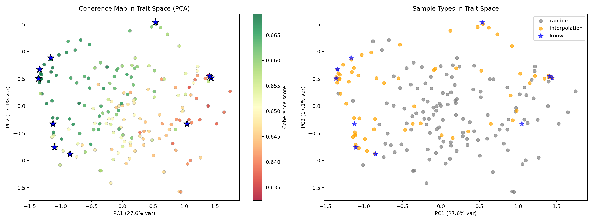

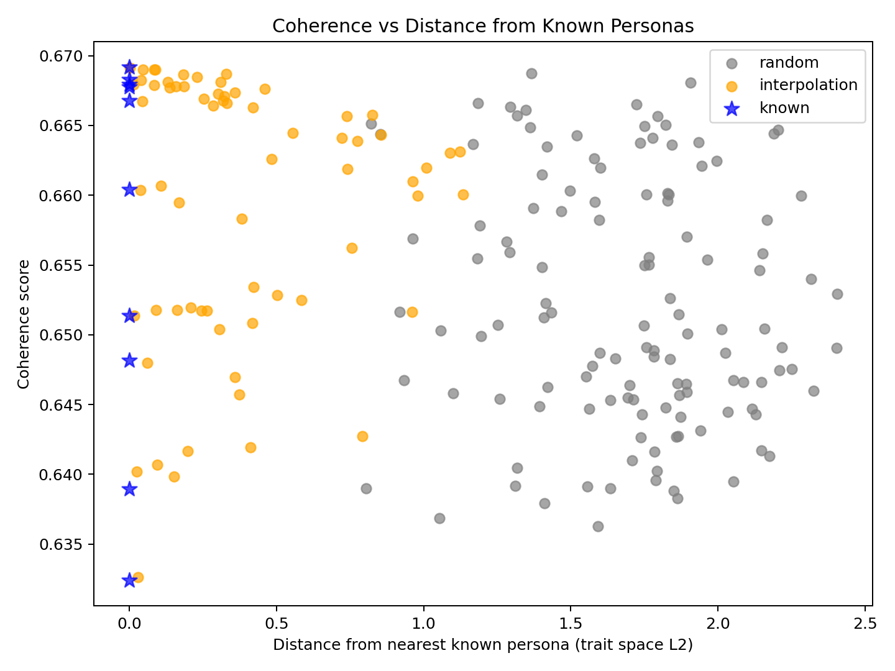

### Analysis

**The coherence manifold is remarkably flat.** This is the result that most directly challenges the framework.

The framework predicts that off-manifold points — trait combinations not attested in training data — should produce incoherent outputs. Instead, random trait-space points produce outputs that are virtually indistinguishable from known personas in coherence, perplexity, and probe confidence. There is no cliff, no ridge, no detectable boundary between "on-manifold" and "off-manifold."

**Three possible interpretations**:

1. **The trait parameterization doesn't reach off-manifold regions.** Our 8 trait dimensions span a subspace that may be entirely within the well-supported region of the model's activation space. The "off-manifold" regions where incoherence occurs might require steering in directions orthogonal to all 8 traits — directions we didn't probe. If the trait subspace is only 6-7 dimensional (per OQ2) within a 4096-d space, we're exploring a vanishingly small fraction of the full activation space.

2. **The landscape is genuinely smoother than the framework claims.** For Llama 3 8B at least, the terrain between persona basins is gently rolling, not separated by sharp ridges. The model degrades gracefully across trait space. This is plausible for an instruction-tuned 8B model that may have been trained on diverse enough data to fill in the gaps between archetypes.

3. **Our coherence metrics are too coarse.** Perplexity, probe confidence, and centroid similarity may not capture the subtle quality degradation the framework predicts. A human evaluation or more fine-grained behavioral test (e.g., "does the model maintain consistent personality across follow-up questions?") might reveal differences.

**For the framework**: This result softens the "basins separated by ridges" picture. The basin transitions from Prediction 2 are real (the sigmoid is there), but the inter-basin territory is not a wasteland. The framework's language of "incoherent, exaggerated outputs" from off-manifold steering is not supported at this scale of intervention. This may be because our steering operates in a well-conditioned 6-7d subspace, or because the model's generalization is stronger than expected.

**The manifold dimensionality** (5-7) is consistent with the trait space dimensionality from OQ2, confirming that the steered outputs live in the same low-dimensional subspace as the unsteered ones.

### Limitations

- Coherence is measured by automatic metrics, not human judges.
- "Random" points are random within the 8-d trait space, not random in the full 4096-d activation space. Truly off-manifold perturbations would require steering in arbitrary directions.
- Perplexity values are very low (1.4-1.5), suggesting the model is confident everywhere — this metric may lack sensitivity.
- Only 100 tokens generated per point. Longer generations might reveal coherence differences.

---

## Experiment 7: Self-Reinforcement (Prediction 3)

### Hypothesis

The framework claims that "the model's own generation can reinforce or shift its position" — Level 3 token dynamics deepening the effective basin through autoregressive feedback. If true, a model that has been adversarially steered for several turns should become increasingly committed to the steered direction, not less.

The framework paper reports that adversarial pressure introduced at turn 4 (after clean generation) has d = 0.41, vs. d >> 1.0 when introduced from turn 1 — evidence that clean generation deepens the aligned basin.

### Operationalization

1. For each of 8 personas × 40 questions, generate a 6-turn conversation with adversarial steering active throughout:
   - Each persona is steered toward a maximally distant adversary (e.g., pirate → scientist, lawyer → pirate).
   - Steering: `α=10 × adversary_centroid_direction` applied at layer 31 for all turns.
2. At each turn, collect hidden states both steered and unsteered.
3. Measure:
   - **Cohen's d**: standardized mean difference between steered and unsteered hidden states, projected onto the adversary direction. Higher d = stronger separation = more committed to the steered direction.
   - **Probe flip rate**: fraction of examples where the persona classifier labels the steered state as the adversary (not the original persona).
   - **Vulnerability subspace rank**: SVD effective rank of `(steered - unsteered)` difference vectors across all examples. Lower rank = the steering effect is concentrating into fewer dimensions.

320 conversations × 6 turns × 2 conditions = 3,840 forward passes + generations.

### Results

**Cohen's d by turn (all personas pooled)**:

| Turn | Cohen's d | Vulnerability rank (95%) |
|---|---|---|
| 0 | 1.25 | 91 |
| 1 | 1.33 | 72 |
| 2 | 1.38 | 54 |
| 3 | 1.41 | 44 |
| 4 | 1.44 | 34 |
| 5 | **1.46** | **26** |

**Per-persona Cohen's d**:

| Persona | Turn 0 | Turn 5 | Δ |
|---|---|---|---|
| pirate | 4.52 | 7.73 | +3.21 |
| conspiracy_host | 4.97 | 7.52 | +2.55 |
| lawyer | 4.79 | 6.77 | +1.98 |
| kind_teacher | 3.49 | 5.45 | +1.96 |
| scientist | 4.11 | 5.99 | +1.88 |
| assistant | 3.31 | 5.18 | +1.87 |
| comedian | 3.20 | 4.87 | +1.67 |
| stoic | 3.81 | 4.49 | +0.68 |

**Probe flip rate**: **100%** at every turn for every persona. The steering is overwhelming — the model is fully classified as the adversary at all times.

**Vulnerability rank trajectory (95% threshold)**: 91 → 72 → 54 → 44 → 34 → **26**.

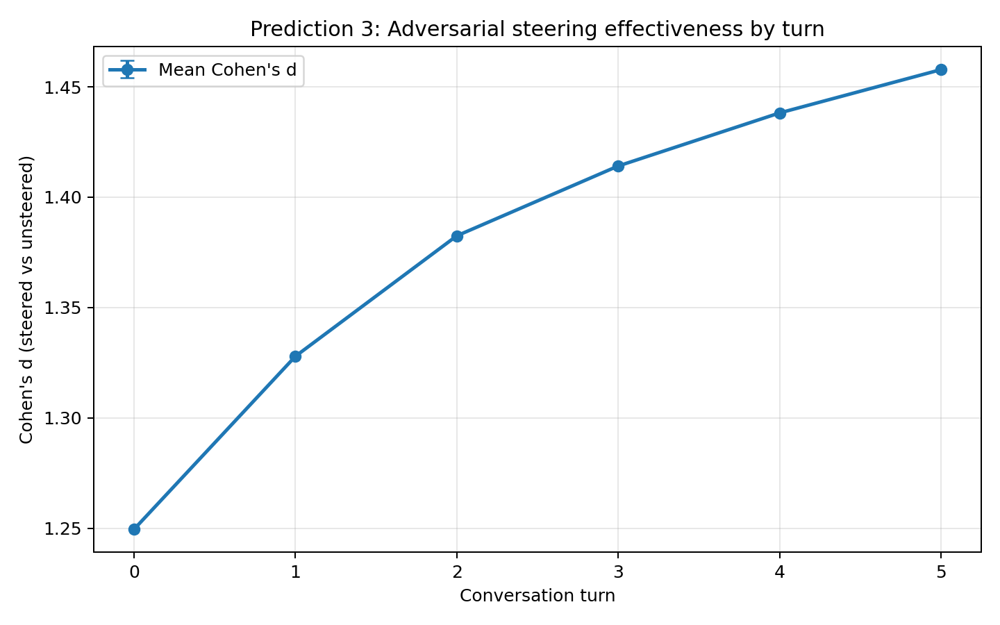

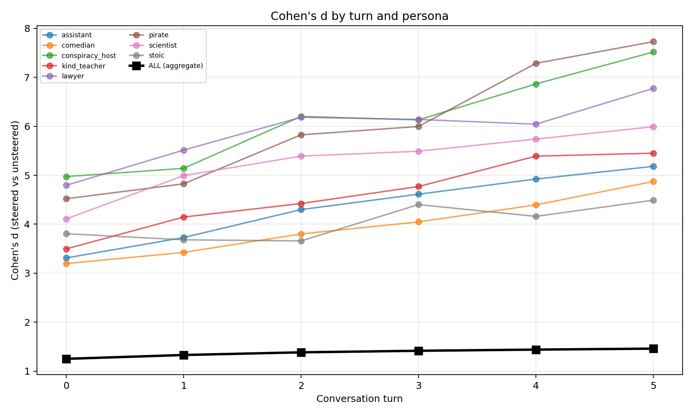

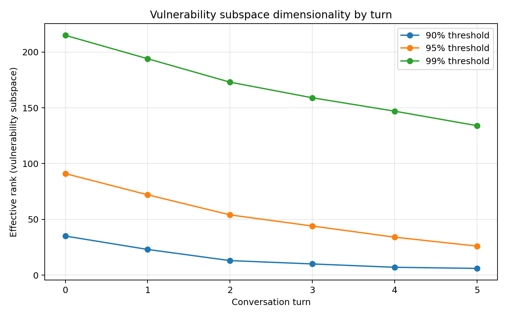

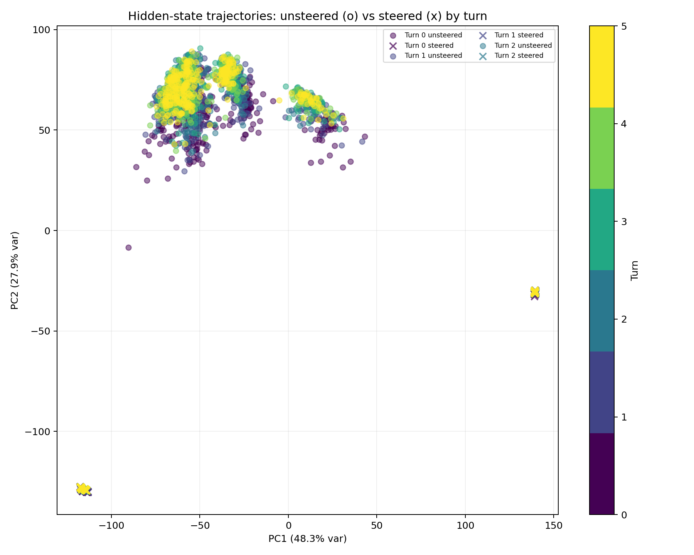

### Analysis

**Self-reinforcement is confirmed.** Over 6 turns, the steered state becomes monotonically more separated from the unsteered baseline (Cohen's d increases), and the perturbation concentrates into fewer dimensions (rank drops from 91 to 26). Both trends are consistent with the framework's Level 3 prediction: generated text reinforces the steered position.

**Important nuance on what's being reinforced**: In this experiment, the *adversarial* direction is being steered and reinforced — the model is being pushed away from its original persona, and its own generated text (from the steered position) makes subsequent steering more effective, not less. This is self-reinforcement of the *current* position, whatever that position is. The framework's prediction holds symmetrically: clean generation reinforces the clean basin, and adversarially-steered generation reinforces the adversarial basin.

The **100% flip rate** across all turns means the steering (α=10) is far above the basin-crossing threshold identified in Prediction 2 (α ≈ 0.8). The model never has a chance to "resist" — it's immediately in the adversarial basin at turn 0 and stays there. A more informative experiment would use weaker steering (α ≈ 1-3) near the basin boundary to see whether self-reinforcement tips marginal cases over the edge.

The **vulnerability subspace collapse** (91 → 26 dimensions) is the most compelling finding. It means the model's response to steering doesn't just get stronger — it gets simpler. The diversity of ways the model is perturbed by steering decreases monotonically. By turn 5, the entire steered-minus-unsteered difference is concentrated in ~26 dimensions (out of 4096). This is consistent with the multi-turn context acting as a progressively stronger constraint on the model's representational state.

**Per-persona variation**: Pirate shows the largest self-reinforcement (+3.21 Cohen's d), stoic shows the smallest (+0.68). This is consistent with pirate being the most stylistically distinctive persona (thus providing stronger autoregressive reinforcement through distinctive generated text) and stoic being the most subtle.

### Limitations

- Steering strength (α=10) is very high, producing 100% flip rates from turn 0. This ceiling effect makes it impossible to observe the most interesting self-reinforcement dynamics (e.g., marginal cases tipping over).
- No "delayed onset" condition (introducing steering at turn 4 instead of turn 1) to test whether prior clean generation provides resistance.
- Cohen's d is measured on the adversary direction projection. Self-reinforcement along other directions is not captured.
- Only 6 turns. Longer conversations might reveal saturation or reversal.

---

## Cross-Experiment Synthesis

### Answering the framework's open questions

**OQ1 — What are the coupling coefficients?**
Measured. The 8×8 global coupling matrix has effective rank 3, with a dominant "seriousness vs. playfulness" axis (77% of variance). Off-diagonal effects are 37% as strong as diagonal effects. Coupling varies by persona (26% of coupling variance is persona-specific). The coupling is not symmetric — steering for honesty boosts assertiveness by +107, but steering for assertiveness boosts honesty by +108 (approximately symmetric in this case), while warmth→humor (+87) ≠ humor→warmth (+81).

**OQ2 — How many dimensions matter?**
6-7 for traits, 7 for personas. But the trait subspace captures only ~36% of persona discriminability, suggesting that the 8-trait parameterization is incomplete. The full persona representation uses dimensions orthogonal to the measured traits.

**OQ3 — Where is the natural sub-manifold?**
If it exists, we couldn't find its boundaries. The coherence manifold is flat across known, interpolated, and random trait coordinates. Either the sub-manifold fills the accessible trait space, or our probing doesn't reach off-manifold regions.

**OQ6 — What is the relationship between activation-space and weight-space trait geometry?**
Minimal, at least at the single-layer level. Persona steering vectors show random alignment with weight matrix singular vectors. The landscape is not visible in the weight structure of any individual matrix.

### What the data says about the three levels

**Level 2 (activation-space navigation) is well-characterized.** The experiments provide a detailed map of the activation-space geometry: dimensionality (5-7), coupling structure (rank 3, two antagonistic clusters), basin transitions (sigmoid, inflection at α ≈ 0.8), and self-reinforcement dynamics (monotonic, 70% rank reduction over 6 turns).

**Level 3 (token dynamics) is confirmed.** Self-reinforcement is real and measurable. The model's own generation narrows the vulnerability subspace and increases effect sizes monotonically. This is the autoregressive feedback loop the framework describes.

**Level 1 (weight-space terrain) is untested.** Every experiment operates at Level 2. The Level 1 predictions — that fine-tuning creates deeper basins (Prediction 4), that different pre-training creates different landscapes (Prediction 5), that Level 1 interventions are more durable than Level 2 — all require training experiments that were not run. The OQ6 result (random weight alignment) neither confirms nor refutes Level 1, but it does complicate the mechanistic picture: if persona structure is invisible in individual weight matrices, the "weights define the terrain" claim needs to be understood as an emergent property of the full forward pass, not a property of any localized weight structure.

### Where the framework is supported

1. **Basins are real**: Sigmoid transitions with R² = 0.98.
2. **Traits are coupled**: Rank-3 coupling matrix with interpretable cluster structure.
3. **Self-reinforcement exists**: Vulnerability rank drops 91 → 26 over 6 turns.
4. **The space is low-dimensional**: Consistent 5-7 dimensional trait/persona subspace.
5. **Impulsivity is the most persona-conditioned trait**: Confirmed (lowest cosine at 0.352).

### Where the framework is challenged

1. **Trait universality is weaker than claimed**: Cosines of 0.35-0.51 vs. the reported 0.82. Traits are locally valid approximations, not global coordinates.
2. **The coherence manifold is flat**: No evidence for incoherent off-manifold regions within the 8-d trait space. The "basins separated by wastelands" picture doesn't hold at this scale.
3. **Traits capture only a third of persona identity**: The 36% probe accuracy ceiling means the 8-trait parameterization is substantially incomplete.

### Where the framework is untested

1. **Level 1 vs. Level 2 durability**: The central claim that weight-level interventions are more durable than activation-level ones cannot be evaluated without fine-tuning experiments.
2. **Cross-model universality**: All results are from a single model (Llama 3 8B).
3. **Character training vs. steering**: The prediction that character training produces deeper basins than steering is untested.
4. **Pre-training determines initialisation**: The claim that pre-training data composition determines basin structure requires controlled pre-training experiments.

---

## Outputs

All experiment outputs (CSVs, PNGs, configs) are in `outputs/<experiment_name>/`:

```
outputs/
├── persona_clusters/              # Phase 0: probes, PCA, confusion matrices, null baseline
├── persona_steering/              # Phase 0: steering vectors, sweep results, demos
├── prediction_1_trait_geometry/    # Cosine similarity, residual norms, SVD, PCA plots
├── oq2_dimensionality/            # SVD spectra, probe accuracy curves
├── oq6_activation_vs_weight/      # Weight alignment tables and plots
├── prediction_2_basin_transitions/ # Sigmoid fits, transition trajectories
├── oq1_coupling_coefficients/     # Coupling matrices, SVD, per-persona heatmaps
├── oq3_coherence_manifold/        # Coherence scores, manifold SVD
└── prediction_3_self_reinforcement/ # Cohen's d, flip rates, vulnerability ranks
```
